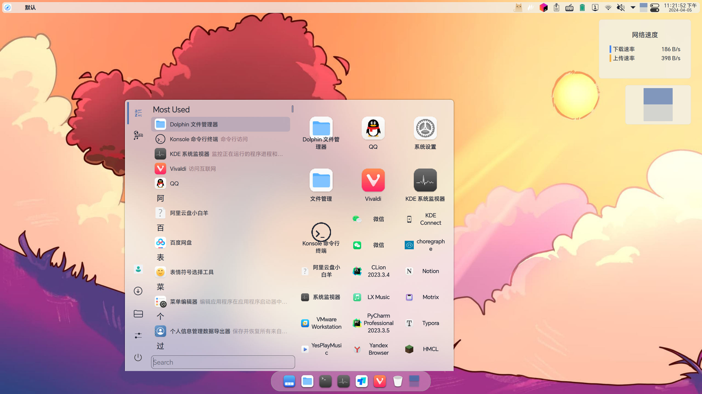
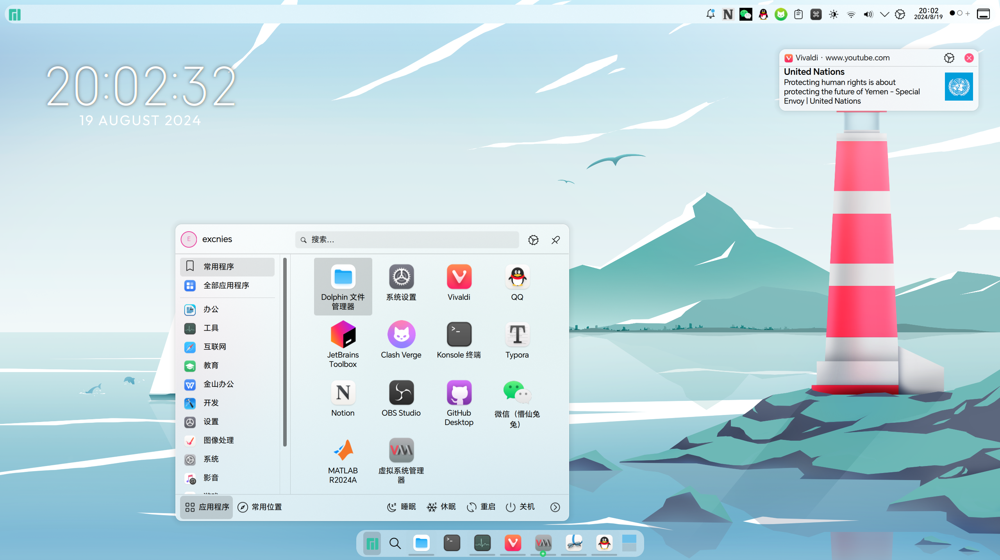
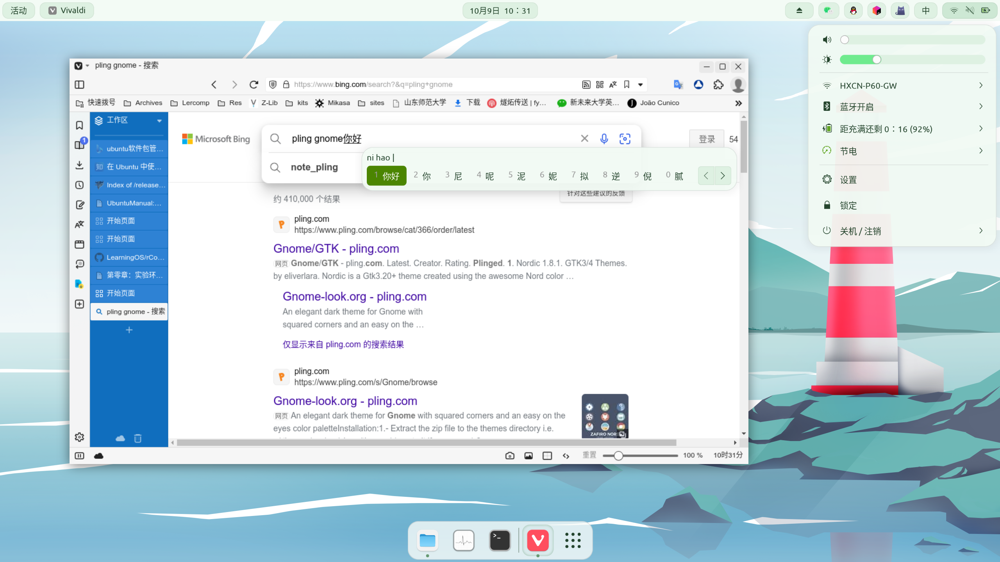

---
【2025年】从零开始Archlinux安装和基础配置实录
---

## 写在前面

2023 年 9 月，在朋友的推荐下，我第一次接触并安装了 Archlinux 的发行版 Manjaro Linux。~~当时的我熟练掌握了 Ubuntu 的虚拟机安装。~~由于对 Linux 不熟练加之深夜安装系统的疏忽，我在外接的硬盘盒安装 Manjaro 时，成功删掉了 Windows 系统的数据🤣。国庆节尝试寻找原厂镜像进行修复，并尝试了 CutefishOS。后来因为其他原因删掉了 CutefishOS。

2024 年寒假在硬盘盒再次安装了 Manjaro Linux，并进行了美化及一系列折腾。但是随着 KDE Plasma 6 在 Manjaro 的正式推送，我在升级软件包时滚挂，丢失了引导，拼尽全力（并非）也没能修复。

2024 年在暑假重新安装了最新的搭载了 Plasma 6 的 Manjaro。当时 Windows 的磁盘空间不足，想要在 Manjaro 使用 Steam Proton 尝试游玩《黑神话·悟空》，但是因折腾 NVIDIA 显卡驱动不当导致开机黑屏，无法进入 sddm，尝试了当时能力内的方法也没能解救。

由于学业等原因，也没有画太多时间尝试修复那个 Manjaro。我在其他硬盘安装 Ubuntu、Deepin 等发行版来满足学习、竞赛及折腾需求，并写了[《从零开始：Ubuntu 24.04 LTS + Win11双系统安装教程》](https://hs.cnies.org/archives/dual-boot-ubuntu2404-win11)、[《Ubuntu 24.04 安装后做什么？必装软件、使用技巧与系统优化指南》](https://hs.cnies.org/archives/ubuntu2404-optimize)等折腾日志。

2025 年暑假，总算抽出时间，此时尝试开机那个黑屏的 Manjaro，但是提示 pacman 索引错误。在对比了多篇技术文章和深度解析后，我决定直接挑战 Archlinux。这个被称为 "Linux 哲学教科书" 的操作系统，将帮助我走出 Ubuntu 的舒适区，顺带巩固我没有系统学但是折腾过程中接触的 Linux 知识。

关于 Archlinux 的相关介绍，请查看 [这篇文章](https://arch.icekylin.online/guide/prepare/understand.html)。

本人使用的是华硕天选 4（i7-13700H + RTX 4060m），硬件较新，因此此前遇到过不少莫名其妙的 kernel pacnic 问题；也可能硬件体质不佳，无论 Windows 和 Linux 总会时不时蓝屏死机。加之网上很多教程并不适用，因此准备写一篇博客记录遇到的问题。

安装过程主要参考了[《archlinux 简明指南》](https://arch.icekylin.online)，针对本人电脑的特殊情况参考了 [ArchWiki](https://wiki.archlinuxcn.org) 和其他网络教程，相关链接分布在文章各个部分。

## 安装之前

前往 [清华大学开源软件镜像站](https://mirrors.tuna.tsinghua.edu.cn/) 下载安装镜像，[使用 Ventory 制作启动盘](https://hs.cnies.org/archives/dual-boot-ubuntu2404-win11#%E5%BC%95%E5%AF%BC-ubuntu-%E5%AE%89%E8%A3%85-u-%E7%9B%98)。也可以参考[《archlinux 简明指南》使用其他工具制作启动盘](https://arch.icekylin.online/guide/rookie/pre-install.html#_3-%E5%88%BB%E5%BD%95%E5%AE%89%E8%A3%85-u-%E7%9B%98)。

为了避免内存焦虑，我购买了两块硬盘专门用于安装 Linux 系统，在使用 Linux 时，取下安装 Windows 的硬盘（只有 C 盘）更换需要的 Linux，这样也避免操作失误删除 Windows 数据。另一个盘位的硬盘用于存储数据。所以本次完全在一块空硬盘进行安装，而不是安装 Archlinux + Windows 双系统,因此不进行分区.分区相关的教程可以参考 [之前的文章](https://hs.cnies.org/archives/dual-boot-ubuntu2404-win11)。

安装前还需要进行关闭设备加密、快速启动、安全引导等准备工作，请查看本人之前安装 Ubuntu 24.04 双系统文章中 [安装前的准备工作](https://hs.cnies.org/archives/dual-boot-ubuntu2404-win11#%E5%AE%89%E8%A3%85%E5%89%8D%E7%9A%84%E5%87%86%E5%A4%87%E5%B7%A5%E4%BD%9C) 和 [引导安装 U 盘](https://hs.cnies.org/archives/dual-boot-ubuntu2404-win11#%E5%BC%95%E5%AF%BC-ubuntu-%E5%AE%89%E8%A3%85-u-%E7%9B%98) 部分的内容。

## 开始安装

经过了一些准备工作，可以开始正式安装 archlinux 了。

0. 进入安装环境
1. 禁用 reflector 服务
2. 连接网络(含测试网络连通性)
3. 更新系统时钟
4. 更换国内软件仓库镜像源(加快下载速度)
5. 分区和格式化（使用 Btrfs 文件系统）
   1. 参考基础安装详解
6. 挂载
   1. 注意boot分区实际挂载的是efi分区
7. 安装系统
8. 生成 fstab 文件
9. change root
10. 设置主机名与时区
11. 硬件时间设置
12. 设置 Locale
13. 为 root 用户设置密码
14. 安装微码
15. 安装引导程序
16. 完成安装
    1. 网络连接

---

桌面环境与常用应用安装

0. 确保系统为最新
1. 配置 root 账户的默认编辑器
2. 准备非 root 用户
3. 开启 32 位支持库与 Arch Linux 中文社区仓库（archlinuxcn）
4. 安装 KDE Plasma 桌面环境
5. 配置并启动 greeter sddm
6. 安装基础功能包
7. 检查家目录
8. 配置非 root 账户的默认编辑器
9. 设置系统为中文
10. 安装输入法
11. 启动蓝牙（若有）
12. 设置 Timeshift 快照
13. 自动生成快照启动项
✨ 太棒了

https://gemini.google.com/u/0/app/d8c44bf676374816

---

kvm

https://cn.linux-console.net/?p=12065
https://zhuanlan.zhihu.com/p/645234144

https://blog.csdn.net/excnies/article/details/149827464
https://blog.csdn.net/excnies/article/details/149801455
